# badapplebench

Cross-language performance benchmarks for [BadAppleStein](https://github.com/TheFirstIstari/BadApplestein) implementations.

Compares arrangement, rendering, and encoding performance across C and Odin (more languages coming).

## Quick Start

```bash
# Install dependencies (mise + hyperfine)
brew install mise hyperfine

# Run full benchmark suite (builds all impls, benchmarks all stages, updates README)
mise run bench
```

## What Gets Benchmarked

Each implementation is benchmarked on three stages using [hyperfine](https://github.com/sharkdp/hyperfine):

| Stage | Description |
|-------|-------------|
| **Arrange** | Decode video frames, match tiles against source library, write manifests |
| **Render** | Assemble frames from manifests, encode output video |
| **Encode** | Full pipeline (arrange + render) end-to-end |

All benchmarks use a standardized test library (2000 pages, 200 frames from badapple.mp4) for fair comparison.

## Adding a New Implementation

1. Add an `[[impl]]` entry to `config.toml`:
   ```toml
   [[impl]]
   lang = "rust"
   label = "v0.1.0"
   git_url = "https://github.com/user/BadAppleRust.git"
   git_ref = "main"
   repo_dir = "BadAppleRust"
   build_cmd = "cargo build --release"
   binary_path = "target/release/badapplerust"

   [[impl.bench_cmds]]
   stage = "arrange"
   cmd = "{binary} arrange --video {video} --lib {lib} --frames {frames}"
   ```
2. Run `mise run bench`

That's it. The benchmark infrastructure handles cloning, building, testing, and README generation automatically.

## Tasks

| Task | Description |
|------|-------------|
| `mise run bench` | Full benchmark suite (build → bench → README) |
| `mise run setup` | Clone repos + generate test library |
| `mise run build-all` | Build all implementations |
| `mise run bench-arrange` | Benchmark arrange stage only |
| `mise run bench-render` | Benchmark render stage only |
| `mise run bench-encode` | Benchmark encode stage only |
| `mise run gen-readme` | Regenerate README from stored results |
| `mise run clean` | Remove test_lib/ and repos/ |

## Results

Results are stored as hyperfine JSON in `results/` (git-tracked) for historical comparison. The README is auto-generated from these results.

<!-- BENCHMARKS_START -->
### Latest Benchmarks (2026-07-26)

| Language | Version | Arrange (s) | Render (s) | Encode (s) | Status | Notes | Git Commit |
|----------|---------|-------------|------------|------------|--------|-------|------------|
| c | v0.2.0 | 3.52 ± 0.02 | — | — | ✓ baseline | Standalone arrange binary (pre-unified). Separate build tar… | af01720 |
| c | v1.0.0 | 1.62 ± 0.03 | — | 1.69 ± 0.07 | ✓ baseline | Unified binary with OpenMP parallel blitting + pthreads enc… | 157ae38 |
| c | v1.0.0-8k | — | — | 33.28 ± 0.76 | — | 8K baseline with --no-hw. OpenMP parallel blitting + pthrea… | 157ae38 |
| odin | dev | **0.15 ± 0.00** | **0.02 ± 0.00** | — | **⚠️ buggy** | 8 swarm optimizations applied (mem.set for solid fill, pre-… | 2c68846 |
| odin | dev-8k | — | — | 275.75 ± 1.47 | — | Single-threaded render, software ProRes (prores_ks). 8K bas… | 8da1a95 |
| zig | dev | — | — | **0.03 ± 0.00** | 🚧 pre-opt | 5 critical bug fixes (Y bounds, EOF-as-error, PTS order, FP… | ba6fa35 |

### Comparative Performance

Total end-to-end time (arrange + render) for each implementation. Lower is better.

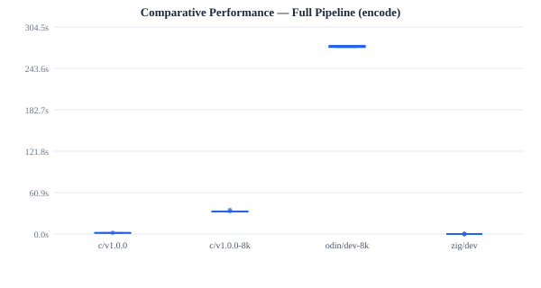

### Performance Distribution by Stage

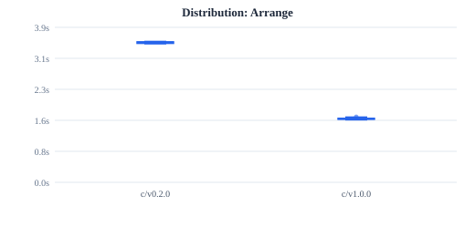

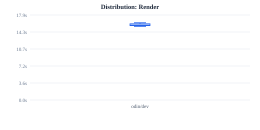

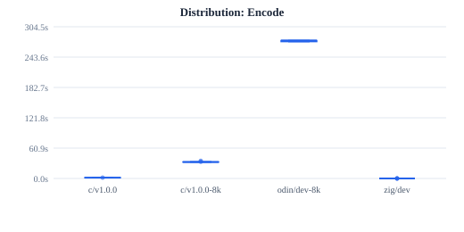

### Performance Distribution by Implementation

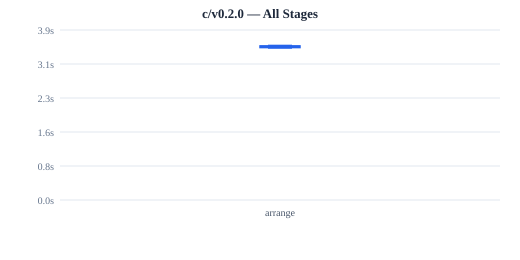

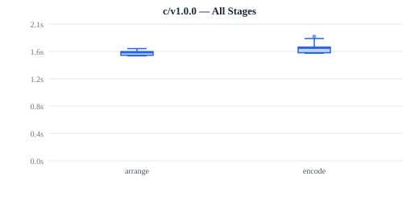

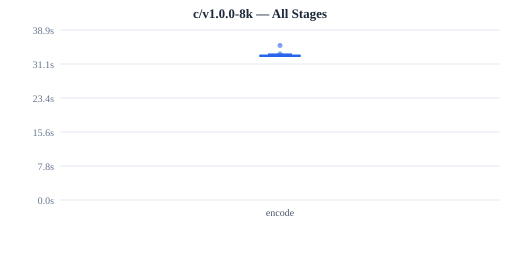

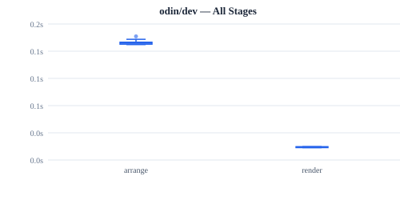

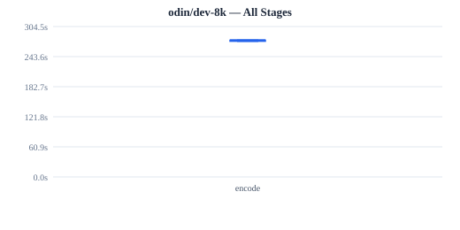

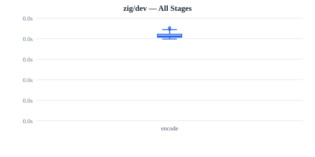

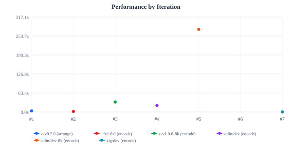

### History

| Date       | Language | Version | Arrange (s) | Render (s) | Encode (s) | Notes |
|------------|----------|---------|-------------|------------|------------|-------|
| 2026-07-25 | c | v0.2.0 | 3.52 | — | — | Standalone arrange binary (pre-unified). Separate… |
| 2026-07-25 | c | v1.0.0 | 1.60 | — | 1.61 | Unified binary with OpenMP parallel blitting + pt… |
| 2026-07-25 | c | v1.0.0-8k | — | — | 33.28 | 8K baseline with --no-hw. OpenMP parallel blittin… |
| 2026-07-25 | odin | dev | 1.23 | 15.81 | 21.50 | Single-threaded render, software ProRes (prores_k… |
| 2026-07-25 | odin | dev-8k | — | — | 275.75 | Single-threaded render, software ProRes (prores_k… |
| 2026-07-26 | c | v1.0.0 | 1.62 | — | 1.69 | Unified binary with OpenMP parallel blitting + pt… |
| 2026-07-26 | odin | dev | 0.15 | 0.02 | — | 8 swarm optimizations applied (mem.set for solid … |
| 2026-07-26 | zig | dev | — | — | 0.03 | 5 critical bug fixes (Y bounds, EOF-as-error, PTS… |
<!-- BENCHMARKS_END -->

## Project Structure

```
badapplebench/
├── config.toml          # Implementation registry (add new langs here)
├── mise.toml            # Task definitions
├── gen_test_lib.py      # Test library generator (from BadApplestein)
├── scripts/
│   ├── setup_impls.sh   # Clone repos, generate test lib
│   ├── build_impl.sh    # Build a specific implementation
│   ├── bench.sh         # Run hyperfine for one impl+stage
│   ├── run_all.sh       # Full orchestration
│   └── gen_readme.py    # README generator from results
├── results/             # Historical hyperfine outputs (git-tracked)
├── repos/               # Cloned source repos (gitignored)
└── test_lib/            # Generated test library (gitignored)
```

## Requirements

- [mise](https://mise.jdx.dev/) — tool version manager
- [hyperfine](https://github.com/sharkdp/hyperfine) — benchmarking tool
- Python 3.12+ (managed by mise)
- C compiler (clang/gcc) with ffmpeg/libav
- Odin compiler (for Odin implementations)

## License

MIT
